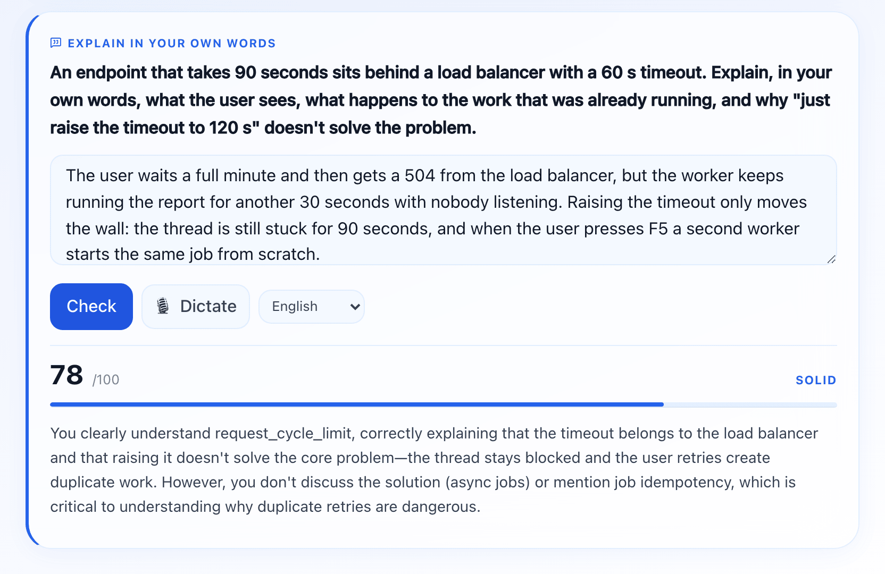
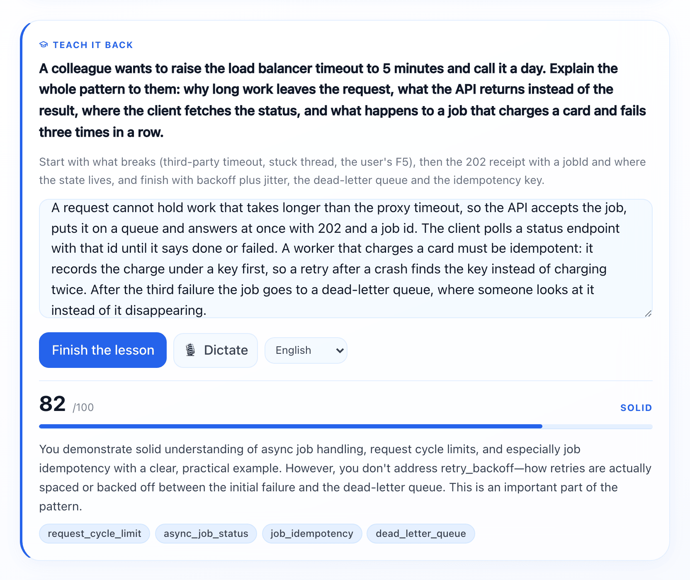

# learno docs

- [How it works](how-it-works.md): the first session, the lesson loop, the three kinds of lesson, mastery and review.
- [Your study folder](workspace.md): what each file is, running the server, language, settings, updates.
- [The engine](engine.md): the lesson format, the server, the progress store, working on the engine.

The rules Claude follows live at the root: [SKILL.md](../SKILL.md) for teaching,
[LESSON-FORMAT.md](../LESSON-FORMAT.md) for writing a lesson, and
[COMPONENTS.md](../COMPONENTS.md) for the blocks a lesson can use.

## Screens

<table>
  <tr>
    <td width="50%" valign="top"> A lesson opens with an everyday analogy before the concept has a name.</td>
    <td width="50%" valign="top"> A recall, graded: score, band and what the answer left out.</td>
  </tr>
  <tr>
    <td width="50%" valign="top"> The teach-back closes the lesson and decides the next review date.</td>
    <td width="50%" valign="top"> The dashboard opens with the next step from NEXT.md.</td>
  </tr>
  <tr>
    <td width="50%" valign="top"> The library, with a score or "not started" on each item.</td>
    <td width="50%" valign="top"> A project brief: what to build and the cases it has to survive.</td>
  </tr>
  <tr>
    <td width="50%" valign="top"> Diagrams are inline SVG and follow the theme.</td>
    <td width="50%" valign="top"> On a phone, through <code>make start</code>.</td>
  </tr>
</table>
