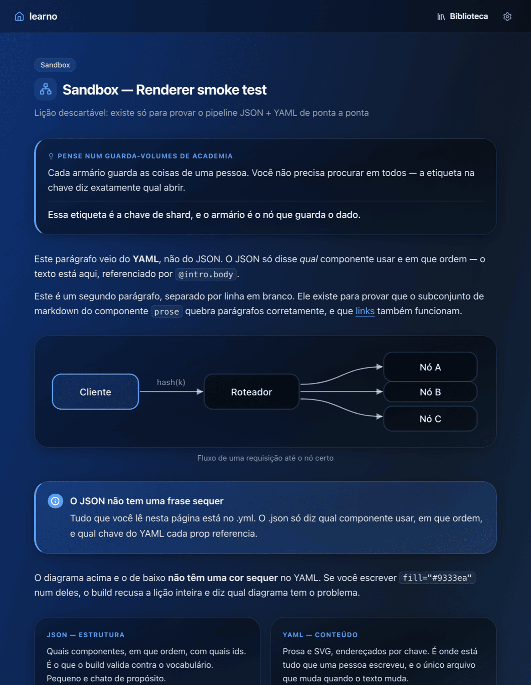
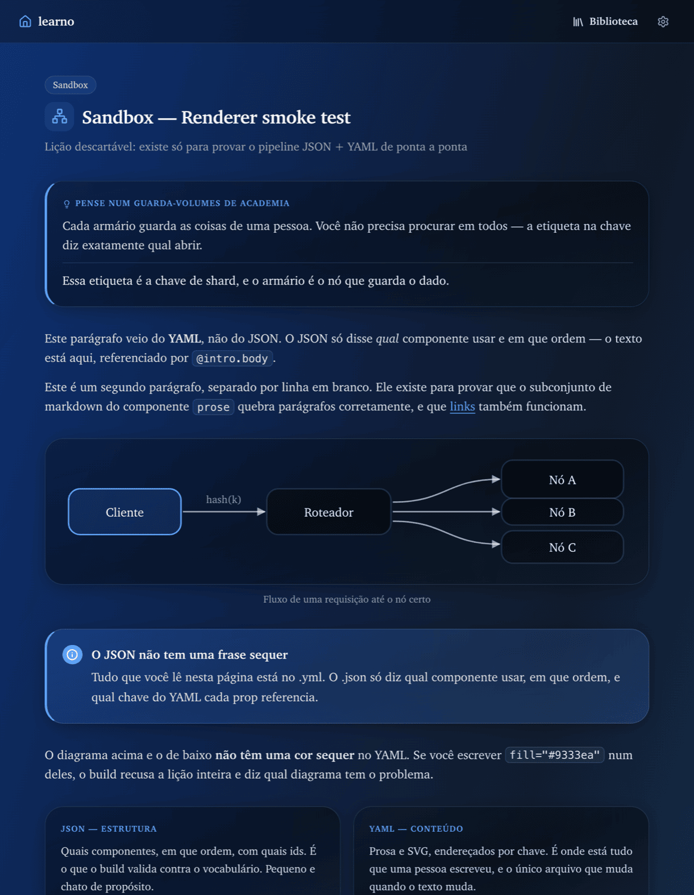
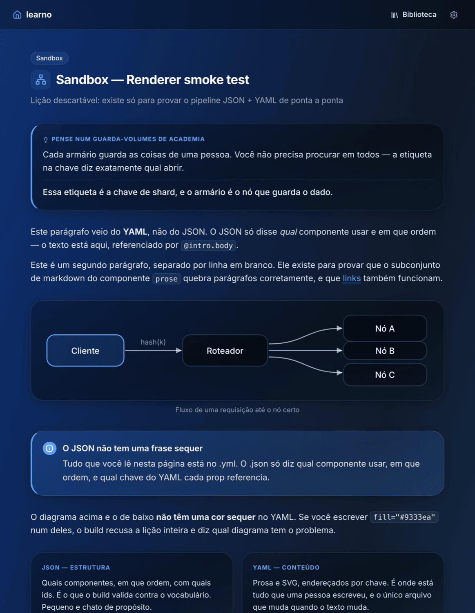
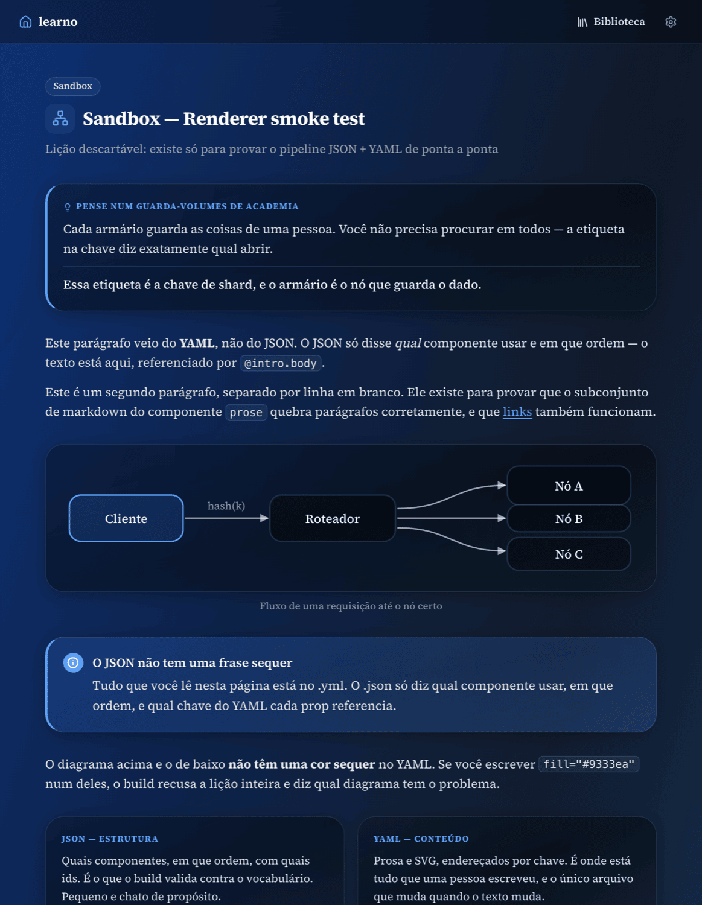
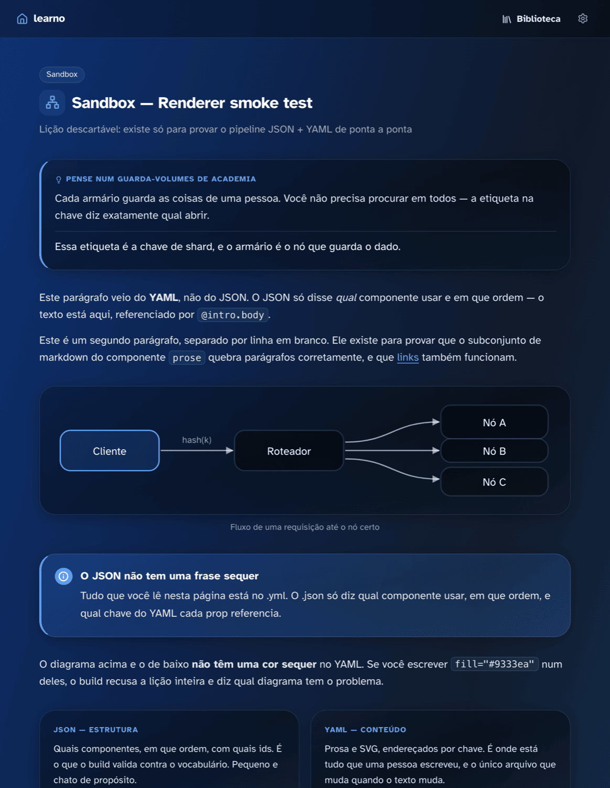

# Typography — five options, one decision

> **Status: open.** Nothing here is adopted. This document exists so the choice
> is made by looking rather than by arguing, and it changes no code: the
> screenshots are the same lesson with one CSS declaration swapped.

The page is currently set in the system UI sans — `-apple-system,
BlinkMacSystemFont, 'Segoe UI', Roboto, sans-serif`. That is a reasonable
default and it was never a decision; it is what the first stylesheet happened to
say.

It is worth deciding on purpose, because of what this product is: **long prose
that has to be read carefully, with technical identifiers scattered through it,
often on a phone, sometimes for an hour.** A UI font is tuned for labels and
buttons — short strings, glanced at. That is not what a lesson is.

## What a choice here has to survive

- **Offline and over `file://`.** A lesson must render with no network. A webfont
  therefore means a `.woff2` committed into `assets/fonts/`, not a CDN link.
- **Portuguese and English**, so the Latin subset has to carry `ã ç õ é ê`.
- **Identifiers inside prose.** `Array#include?`, `O(n²)`, `admin_array` appear
  mid-sentence. Ambiguous `l` / `I` / `1` and `0` / `O` cost the reader real time.
- **Dark mode first**, where thin strokes disappear and heavy ones bloom.
- **A page weight budget.** Every extra kilobyte is paid on a phone, once per
  cold load.

## The five

### 1. System sans — what is there today

**Cost: nothing.** No file, no bytes, and it is the font the reader's OS already
renders best.

Neutral to the point of invisible. On a Mac it is SF Pro, which is excellent and
which every app they use also uses — a lesson looks like a settings panel.

### 2. System serif — `ui-serif`

**Cost: nothing.** Resolves to New York on Apple, Cambria or Georgia elsewhere.

The cheapest way to stop looking like an app. Serifs help the eye track long
lines, and the shift in register says "this is something to read" before a word
is read. The risk is that it renders as a *different* font per platform, so the
page you design is not the page half the readers see.

### 3. Inter — the modern UI sans

**Cost: ~47 KB.** Variable weight, one file.

More neutral and more even than SF at small sizes, with better numerals and a
disambiguated `l`/`I`. It is the safest upgrade: nothing about the page changes
except that everything gets slightly more legible and slightly less Apple. It is
also the most-used interface font on the web, which cuts both ways.

### 4. Source Serif 4 — a serif drawn for screens

**Cost: ~50 KB.** Variable weight, one file.

Warmer than Georgia and designed for long reading on a display rather than
adapted from print. This is the option that most changes what the product feels
like: less dashboard, more textbook. The counter-argument is the chrome — buttons
and labels in a serif read as dated unless the UI stays sans, which means two
families and a rule about which goes where.

### 5. Atkinson Hyperlegible — legibility as the brief

**Cost: ~34 KB** for regular and bold.

Drawn by the Braille Institute for readers with low vision: every character is
made as distinct from its neighbours as possible, which is exactly the property
that matters when `1`, `l` and `I` are all in the same sentence about a loop
counter. It is less elegant than the others and it looks slightly unusual, which
is the price of the thing it is good at.

## What adopting one looks like

Whichever wins, the change is the same shape and small:

1. A `--lx-font` custom property in `:root`, and every `font-family` in the
   stylesheet pointing at it — there is currently one declaration, repeated.
2. For 3, 4 or 5: the `.woff2` committed under `assets/fonts/`, an `@font-face`
   with `font-display: swap`, and a system fallback in the stack so the page is
   readable before the font arrives.
3. Code stays monospace regardless. That is not part of this decision.

Option 4 additionally needs a second family for the chrome, and a rule for where
the boundary falls — the simplest being: serif inside `.lx-blocks`, sans
everywhere else.
